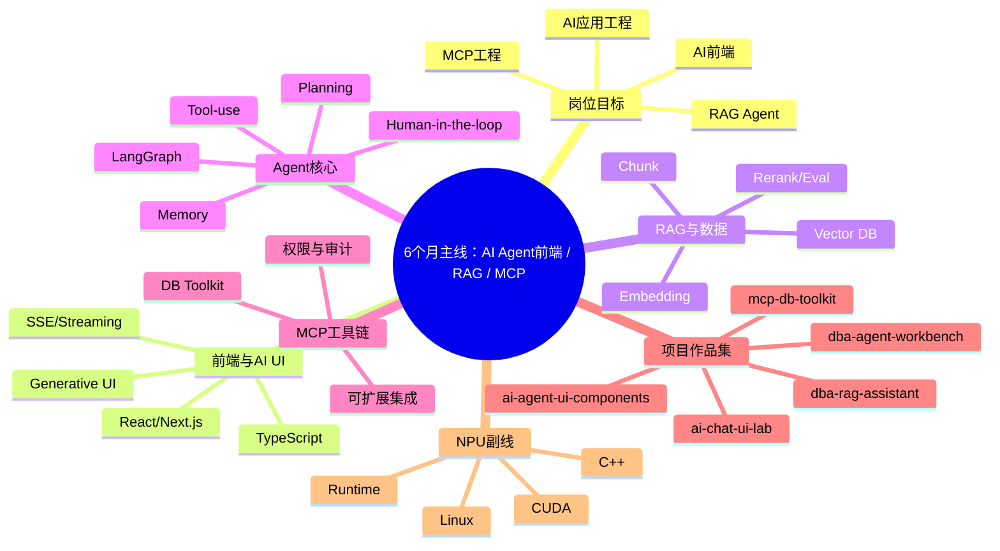

# AI Agent 前端 / RAG / MCP 6 个月详细学习计划

> 主线：阿里云 AI Agent 前端 / AI 全栈应用工程；副线：NPU 系统软件长期补课。

## Mermaid 思维导图

## 24 周计划
| 周 | 主题 | 学习任务 | 实战任务 | 验收标准 |
|---|---|---|---|---|
| 1 | 环境与前端骨架 | 搭好 Mac mini/电脑环境；复习 TS 类型、React Hooks、Next.js App Router；明确项目 monorepo 结构。 | 创建 ai-chat-ui-lab：会话列表、聊天窗口、右侧工具面板；不接模型，先 fake 数据。 | GitHub 初始化；README 有架构图草稿；页面在 1440px 和移动端都可用。 |
| 2 | Streaming Chat UI | 学习 SSE、WebSocket、AbortController、消息状态机、Markdown/代码块渲染。 | 接 fake streaming API：逐字输出、停止生成、重新生成、错误重试、复制代码。 | 录 GIF；能解释 SSE 与 WebSocket 区别；写一篇流式渲染笔记。 |
| 3 | LLM Gateway | 学习 OpenAI-compatible API、模型切换、超时、重试、token/耗时统计。 | 创建 llm-gateway：统一封装模型调用，支持 streaming、日志、fallback。 | 前端接真实模型；每次请求记录 model、latency、tokens、error。 |
| 4 | RAG 入门 | 学习 Embedding、Chunk、Vector DB、topK、metadata、citation。 | 创建 dba-rag-assistant：上传 DBA 文档、切块、入库、提问、返回引用。 | 完成 10 个 DBA 问题测试；能说清 RAG 数据流。 |
| 5 | RAG 质量优化 | 学习 query rewrite、multi-query、rerank、guardrail、bad case 记录。 | 增加命中文档展示、相似度分数、回答引用、找不到则拒答。 | 沉淀 30 条测试集；README 写清 chunk 策略和评测结果。 |
| 6 | Function Calling | 学习 tool schema、参数校验、工具选择、工具结果回填、危险操作确认。 | 为 DBA Agent 增加 search_docs、explain_sql、analyze_slow_query、diagnose_deadlock 等工具。 | 所有工具有 zod/pydantic schema；危险动作默认只读或需要确认。 |
| 7 | LangGraph 基础 | 学习 StateGraph、Node、Edge、checkpoint、streaming、human-in-the-loop。 | 实现 planner -> retriever -> tool_executor -> analyzer -> finalizer 的最小图。 | 能在控制台看到每个节点状态；失败后可重试。 |
| 8 | 数据库排障 Agent | 把真实 DBA 排障流程结构化：CPU 飙高、慢 SQL、死锁、主从延迟。 | 创建 db-troubleshooting-agent：输入故障，输出 checklist、诊断 SQL、风险提示。 | 完成 4 类故障流程；每类至少 5 个测试问题。 |
| 9 | MCP Server | 学习 MCP tools/resources/prompts、server/client、权限、审计。 | 创建 mcp-db-toolkit：暴露数据库健康检查、知识库搜索、SQL Review 等工具。 | 本地 MCP Inspector 可调通；每次工具调用有日志。 |
| 10 | MCP + Agent 集成 | 理解 MCP 与普通 REST API 的差异：标准化工具发现、上下文接入、客户端复用。 | 让 Agent 通过 MCP 调用 DB Toolkit；前端展示工具 schema 和结果。 | 能录制“Agent 调用 MCP 工具链”的完整演示。 |
| 11 | Agent Workbench | 学习 AI 产品前端：执行轨迹、任务状态、引用文档、artifact 面板。 | 创建 dba-agent-workbench：左会话、中对话、右执行轨迹。 | 支持 planning/retrieving/calling/waiting/analyzing/done 状态展示。 |
| 12 | Human Approval 与审计 | 学习生产安全：权限分级、敏感信息过滤、操作确认、审计回放。 | 增加工具调用审批、拒绝/继续、审计日志、执行回放。 | 能解释 prompt injection 与 tool abuse 的防护思路。 |
| 13 | Generative UI | 学习 JSON schema 输出、Artifact UI、动态组件、安全渲染。 | 让 Agent 生成慢 SQL 分析卡片、执行计划表、恢复时间线、风险 Badge。 | 组件可编辑、可复制、可导出；异常 JSON 不崩页面。 |
| 14 | Design System / 组件库 | 学习组件抽象、主题、响应式、可访问性、Storybook 可选。 | 抽出 ai-agent-ui-components：ChatMessage、ToolCallCard、AgentStepTimeline、ArtifactPanel。 | 组件有独立 README 和示例；主项目通过 package 引用。 |
| 15 | 前端性能与稳定性 | 学习虚拟列表、token 合并刷新、memo、错误边界、断线重连。 | 优化长消息和 1000 条消息场景；工具失败可重试。 | 写性能报告；Playwright 覆盖核心链路。 |
| 16 | Docker 私有化部署 | 学习 Dockerfile、Compose、Postgres/pgvector、Redis、Nginx、环境变量。 | 一条 docker compose up 启动 web、api、agent-worker、postgres、redis、mcp-server。 | README 提供本地/服务器部署步骤；能在新环境跑通。 |
| 17 | 可观测性与 Eval | 学习 trace、metrics、latency、success rate、成本统计、评测集。 | 创建 agent-eval-harness：50 条 DBA 场景评测、工具成功率、引用命中率。 | 输出 eval 报告；失败样例进入 bad_cases.md。 |
| 18 | 开源贡献 | 选择 Dify、LangGraph、Open WebUI、Firecrawl、MCP servers 中一个做小贡献。 | 提交 1 个文档/示例/bug 复现 PR；同时提 2 个高质量 issue。 | 至少有 1 个 merged PR 或被维护者有效回复。 |
| 19 | 作品集打磨 | 学习项目包装：截图、GIF、架构图、技术难点、演示脚本。 | 完善 3 个 pinned repos：workbench、mcp toolkit、ui components。 | 每个 README 都有背景、架构、启动、截图、难点、后续计划。 |
| 20 | AI 前端面试 | 复习 React、TS、浏览器、网络、安全、性能、流式渲染。 | 整理 60 道问答；给项目补“面试可讲点”。 | 能 10 分钟讲清 dba-agent-workbench 架构。 |
| 21 | Agent 系统设计 | 复习 RAG、Agent、MCP、权限、观测、降级、成本控制。 | 设计题：企业知识库 Agent / 数据库排障 Agent / AI 工具平台。 | 每个系统设计都有架构图、数据流、风险和扩展方案。 |
| 22 | 简历与投递 | 提炼关键词：AI 前端、RAG、Agent、MCP、AI-Native UI、Observability。 | 制作 1 页项目型简历；准备 Boss/拉勾/猎聘投递话术。 | 投递 20 个匹配岗位；记录 JD 关键词和反馈。 |
| 23 | 针对性补短板 | 根据面试反馈补 React 基础、系统设计、RAG 评测、MCP 安全。 | 给项目补缺：测试、错误处理、权限、部署文档。 | 完成第二轮 mock interview；形成错题本。 |
| 24 | Release v1.0 | 整理 6 个月成果，做最终演示和复盘。 | 给 dba-agent-workbench 打 v1.0 tag，发布 demo 视频/GIF，写总结文章。 | 可直接投递；简历、作品集、演示脚本完整。 |

## 每日节奏
- 工作日 2-3 小时：30 分钟官方文档，90 分钟编码，30 分钟调试，20 分钟学习日志，10 分钟 commit。
- 周末 6-8 小时：补项目、录 GIF、写 README、做复盘。

## 参考资料
- LangGraph Overview: https://docs.langchain.com/oss/python/langgraph/overview
- Model Context Protocol Intro: https://modelcontextprotocol.io/docs/getting-started/intro
- Vercel AI SDK Introduction: https://ai-sdk.dev/docs/introduction
- Dify Documentation: https://docs.dify.ai/
- NVIDIA CUDA Programming Guide: https://docs.nvidia.com/cuda/cuda-programming-guide/index.html
- AMD ROCm Documentation: https://rocm.docs.amd.com/en/latest/